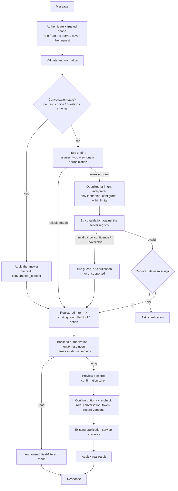

# Chatbot — Hybrid AI Interpretation (OpenRouter)

The assistant understands both fixed phrasings and free-form questions by combining the existing **rule engine** with an **OpenRouter model used only as an interpreter**. See `docs/openrouter-chatbot-analysis.md` for the repository analysis this was built from.

## Request flow



The model is an interpreter, never an executor: it receives only the current message, a role-filtered intent list and a closed JSON schema. It never sees tickets, people, permissions, other users' data or credentials, and it can neither call tools nor confirm anything.

## Priority

1. Conversation state (an answer to a question the assistant just asked, or a numbered choice)
2. Exact / pattern rule with high confidence: **the model is not called**
3. OpenRouter interpretation (rules matched only weakly or not at all)
4. Clarification
5. Unsupported (with working example questions)

A rule counts as *reliable* when it is a structured pattern (ticket number, action phrase, report/department patterns, aliases such as `shw tikets for all depts`), the whole message is a knowledge-base keyword, or a question-shaped message has one clear knowledge-base winner. A lone generic word inside a free-form sentence is only a weak guess: the model may override it, and the guess is the fallback if AI is unavailable.

## Configuration (`server/.env`, documented in `server/.env.example`)

| Variable | Default | Purpose |
|---|---|---|
| `AI_INTERPRETATION_ENABLED` | `false` | master switch |
| `AI_PROVIDER` | `disabled` | `openrouter`, `mock` (tests/dev), `disabled` |
| `OPENROUTER_BASE_URL` | `https://openrouter.ai/api/v1` | must be https |
| `OPENROUTER_API_KEY` | — | server side only. The placeholder `your_server_side_key` is treated as *not set* |
| `OPENROUTER_INTENT_MODEL` / `_FALLBACK_MODELS` | — | interpreter model + ordered fallbacks (max 3 tried) |
| `OPENROUTER_SUMMARY_MODEL` / `_FALLBACK_MODELS` | — | optional: phrasing/summary model (see below) |
| `OPENROUTER_TIMEOUT_MS` | `10000` | one overall budget for every attempt and fallback |
| `OPENROUTER_MAX_RETRIES` | `1` | per model, transient errors only |
| `OPENROUTER_MIN_CONFIDENCE` | `0.80` | below this the answer is not used |
| `OPENROUTER_TEMPERATURE` / `_MAX_OUTPUT_TOKENS` | `0` / `500` | |
| `OPENROUTER_REQUIRE_STRUCTURED_OUTPUT` | `true` | send a strict JSON schema; models without support are not used |
| `OPENROUTER_REQUIRE_SUPPORTED_PARAMETERS` | `true` | sends `provider.require_parameters` so an endpoint that cannot honor the schema is refused |
| `OPENROUTER_APP_NAME` / `_APP_URL` | | attribution headers |
| `OPENROUTER_ALLOWED_PROVIDERS` | empty | approved upstream providers; when set, only these are used and fallback to others is disabled |
| `OPENROUTER_DATA_COLLECTION` | `deny` | asks OpenRouter to route only to providers that do not retain/train on prompts |
| `AI_LOG_PROMPTS` / `AI_LOG_RESPONSES` | `false` | when on, logs are redacted (emails and long numbers masked) |
| `AI_REDACT_SENSITIVE_DATA` | `true` | strips secrets (tokens, keys, "password is …") from the message before it is sent |
| `AI_MAX_INPUT_CHARS` | `1000` | longer messages are not sent |
| `AI_MAX_CALLS_PER_USER_PER_DAY` | `200` | cost cap (in-memory per process) |
| `AI_CIRCUIT_BREAKER_FAILURES` / `_COOLDOWN_MS` | `3` / `60000` | after repeated failures the model is skipped until the cooldown ends |
| `AI_CAPABILITY_CACHE_MS` | `3600000` | how long catalog capability metadata is cached |
| `AI_EXPOSE_MODEL_METADATA` | on outside production | include the model id in `interpretation` |

**Model ids are never hard-coded.** To choose them:

```bash
cd server
npm run ai:check -- --candidates   # catalog models that meet the requirements, cheapest first (no key needed)
# put your choice in server/.env, then:
npm run ai:check                   # verifies the intent model, every fallback and the summary models
```

`ai:check` reads the public model catalog only (it never sends your key and never calls a model). A model is rejected when it is missing from the catalog, expired, lacks text input/output, lacks structured-output support (when required), has too small a context (< 8000) or a lower maximum output than configured. Fallbacks must meet the same structured-output requirement. A rejected model is simply not used: **nothing silently switches to a different model**, and the rule engine keeps working. The same report is available to admins at `GET /api/v1/chatbot/diagnostics/ai` (never contains the key). The catalog is not fetched per message; capability metadata is cached.

Choose models whose provider terms you have approved for your data. `:free` tiers commonly retain prompts, and OpenRouter's automatic routers choose the provider per request; `ai:check --candidates` excludes routers and flags free tiers.

## What the model receives and returns

Sent: the current message (secrets redacted), a system prompt built from the **server registry** for the caller's role only, and a strict JSON schema (`intent` enum = that role's registered intents + `UNSUPPORTED`; a closed, flat, all-nullable `parameters` object; `confidence`; `missingFields`; `requiresClarification`). Nothing else: no tickets, people, ids, history, emails from the database, tokens or permissions (tested).

Returned (validated; anything else is discarded): see `interpretation/intentSchemas.js#validateInterpretation`. Unknown intent, extra fields, extra or not-allowed parameters, wrong types, over-long values, out-of-range confidence, an intent the caller's role may not use, or low confidence are all rejected. A database id supplied by the model is just an unknown parameter. The server, not the model, decides which required details are missing.

## Intent registry (`interpretation/intentRegistry.js`)

Each entry defines id, description, safe examples, allowed roles, read/write classification, risk, allowed parameters, required fields, entities the backend must resolve, the controlled backend route, confirmation policy and the rule/AI switches. **Every intent maps onto an existing handler, guidance article or admin action**, so a rule-matched and an AI-matched request end up in the same secured tool.

This application has no granular permission table, so a "required permission" is the entry's role set plus the existing row-level scope rules enforced inside each tool. It has no SLA, workflow or escalation data, no department activation flag and no tenant concept, so those requested intents are either answered honestly ("not tracked") or not registered (see the analysis document). Registered: guidance (profile, password, navigation, status/priority/SLA/escalation/notifications, create ticket, attachments, assignment), ticket reads (mine/open/pending, search with priority/department/status filters, ticket by number, summary, history, pending actions, unassigned, no recent activity, statistics, department-wise summary with ranking, weekly report), admin reads (departments, members, headcount, users by role, manager assignments, one person's summary) and admin writes (create/rename department, rename/activate/deactivate user, change role, move user to department, assign/remove Manager or Team Lead, change ticket priority, close ticket), plus explained-but-not-executed requests (create user, reset password, delete department, reassign/escalate ticket).

## Entity resolution, clarification, selection

The model supplies text references (`"Arun"`, `"Finance"`). The backend resolves them to ids, searching only what the caller may see; zero matches, several matches and fuzzy department names are handled server-side. With several matches the assistant lists numbered choices; the ids stay in server-side conversation state (the previous assistant message, valid for 10 minutes, only that message), and the pick resumes the request with the chosen id, re-validated at preview time. Missing required details ("Add an employee to Finance") are asked for, and the next message answers them.

## Writes

The model can identify a write; it can never perform one. Every write: validate → resolve → preview with impact → **Confirm button** (a separate authenticated call). Confirmation is bound to the admin, the conversation and a secret one-time token (only its SHA-256 is stored), expires in 10 minutes, is claimed atomically (single use), re-checks the admin role, and refuses to run if the records involved changed since the preview (`updatedAt`/status fingerprint). Execution goes through the existing service, which does its own validation, transaction and audit logging; the chatbot adds `CHATBOT_ACTION_EXECUTED` (with how the request was understood) and `chat_audit_events`. A typed "yes" never confirms; a typed "cancel" only discards.

## Summaries

If `OPENROUTER_SUMMARY_MODEL` is configured, the summary model rephrases answers about tickets, using the server-built draft plus the already-authorized, minimized DTOs fenced as untrusted data. It never counts, ranks or decides permissions (the draft already contains those results), and its output is validated (no prompt echo, no ticket numbers outside the authorized set); any failure falls back to the server's own text. Without a summary model, rule-built text is used.

## Failure behavior

OpenRouter unavailable, key missing/invalid, timeout, rate limit, unsupported structured output, malformed JSON, all fallbacks failing, circuit open or daily cap reached: the rule engine continues; unrecognized wording gets "AI interpretation is unavailable right now" with example questions that work; no partial model output is ever executed; writes still require confirmation.

## Telemetry and privacy

Logged per call: `method`, model id, status, rejection reason, intent id, latency, token counts (from the provider's usage). Not logged by default: prompts, responses, ticket content, keys or headers. Audit events: `AI_INTERPRETATION`, `AI_INTERPRETATION_UNAVAILABLE`, `AI_DIAGNOSTICS`.
