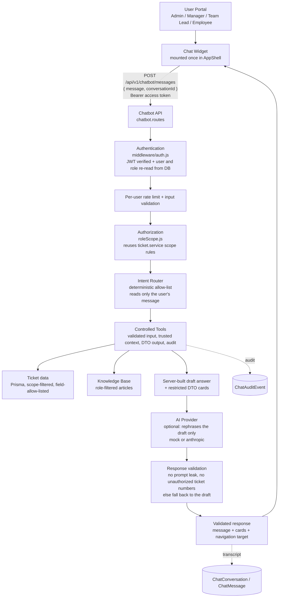
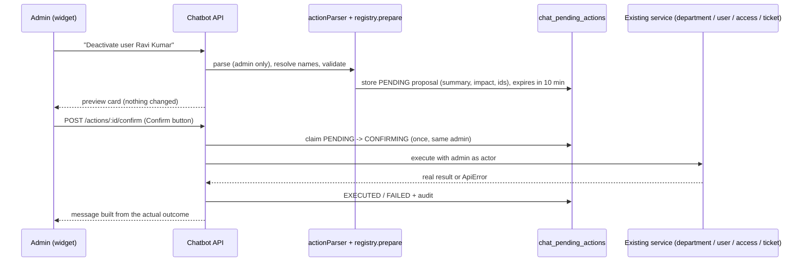

# Chatbot — Architecture

The assistant is a **role-aware helper** (read-only for everyone except Admins, whose limited changes always require a confirmation, see below) embedded in all four portals (Admin, Manager, Team Lead, Employee). It answers "how do I…" questions from a role-filtered knowledge base and answers ticket questions from data the caller is already authorized to see.

## Request flow

## Key design decisions

1. **The model never decides what is accessed.** An allow-listed, deterministic intent router (`chatbot/intents/router.js`) picks the intent from the user's own message, and a fixed tool registry (`chatbot/tools/`) runs it. The model cannot call tools, build queries, or see a database handle.
2. **The model is only a phraser.** Each ticket-data handler builds a *draft* answer from structured facts. A provider may rephrase it; the output is validated (`providers/validate.js`) and any failure falls back to the draft. Structured cards (ticket lists, summaries, history, statistics) always come from DTOs, never from model text. With `CHATBOT_PROVIDER=mock` (default) the draft is returned unchanged.
3. **Free text from tickets never enters the draft or the system prompt.** Titles, summaries, comments and reasons appear only in DTO cards and, if a real provider is used, inside a JSON block delimited as untrusted data.
4. **Authorization is the application's own.** `roleScope.js` calls `ticket.service`'s `scopeWhereForTab`/`resolveUserDepartmentIds`; there is no second copy of the access rules.
5. **Guidance is not generated.** Navigation/how-to answers are returned verbatim from knowledge-base articles (routes and labels read from the frontend), so the model cannot invent menu names.
6. **Honest about missing features.** SLA and escalation are not tracked by this application; the assistant says so rather than inventing data (see the analysis doc).

## Backend layout (`server/src/chatbot/`)

| File / folder | Responsibility |
|---|---|
| `chatbot.routes.js` | auth → rate limit → validation → controller; chatbot-local error handler |
| `chatbot.controller.js` / `chatbot.schemas.js` | thin HTTP layer; express-validator request schemas |
| `chatbot.service.js` | conversation ownership, orchestration, model phrasing + fallback, persistence, feedback |
| `chatbot.errors.js` | standardized error codes and user-facing messages |
| `chatbot.audit.js` | writes `ChatAuditEvent` rows (no content) |
| `roleScope.js` | authenticated user → ticket scope (reuses `ticket.service`) |
| `dto.js`, `text.js` | field allow-lists, plain-text conversion, delimiter defanging |
| `intents/router.js`, `intents/handlers.js` | intent classification and per-intent tool orchestration |
| `tools/` | tool registry: `get_current_user`, `get_portal_capabilities`, `get_profile_summary`, `get_navigation_steps`, `search_authorized_tickets`, `get_authorized_ticket`, `summarize_authorized_ticket`, `get_authorized_ticket_history`, `get_authorized_ticket_statistics`, `get_status_definition`, `get_priority_definition`, `get_sla_information`, `get_knowledge_article` |
| `prompts/` | common safety rules + Employee / Team Lead / Manager / Admin prompts |
| `knowledge/` | `common/`, `employee/`, `team-lead/`, `manager/`, `admin/` articles |
| `providers/` | provider interface, `mock`, `anthropic`, config validation, output validation |
| `suggestions.js` | per-role suggested prompts and welcome message |
| `testkit/`, `__tests__/` | in-memory Prisma double, fixtures, tests |

## Frontend layout (`client/src/`)

`components/chatbot/` (`ChatWidget`, `ChatPanel`, `ChatMessage`, `SuggestedPrompts`, `TicketListCard`, `TicketSummaryCard`, `TicketHistoryCard`, `StatisticsCard`, `ChatFeedback`, `ChatErrorState`), `hooks/useChatbot.js`, `api/chatbot.js`, `types/chatbot.js`. The widget is mounted once in `components/layout/AppShell.jsx`, which `AdminLayout`, `AgentLayout` (Manager and Team Lead) and `PortalLayout` (Employee) all render.

Profile and password screens are dialogs (not routes), so the assistant opens them through a callback from `AppShell` (`onOpenDialog`).

## Data model

New tables (migration `20261006090000_add_chatbot_tables`): `chat_conversations`, `chat_messages`, `chat_feedback`, `chat_audit_events`. No existing chat/feedback/knowledge tables existed to reuse; `audit_logs` is left for administrative actions. The transcript stores only the filtered, user-visible DTO — never raw rows, prompts, tokens or headers.

## Admin changes (`chatbot/actions/`)

`actions/registry.js` is the complete list of changes the chatbot can make (it has no delete, create-user or password operations); `actions/actionService.js` holds propose/confirm/cancel; `actions/resolvers.js` turns typed names into records and rejects ambiguity.

## Not implemented (by design)

Creating users, password reset, deleting departments/users, ticket reassignment/transfer/escalation (the application has none for Admins), and any change by non-admin roles.
